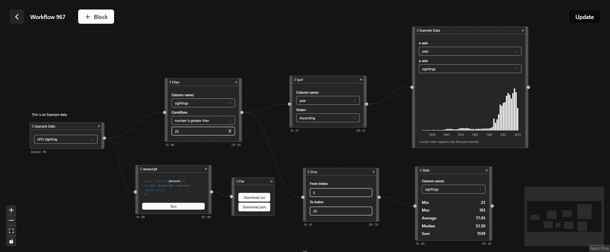

# XlFlow - A Node-Based Editor

## Overview

XlFlow is a node-based editor designed for exploring, analyzing, and transforming data without the need to write code. It offers built-in transformation blocks for tasks like filtering, grouping, merging, and sorting data. Additionally, it features custom code blocks, allowing for advanced data manipulation. The platform provides quick data insights by automatically selecting the appropriate output view for your dataset. Built on the open-source library React Flow, XlFlow simplifies data-wrangling tasks for users.



## Tech Stack

- **Frontend:** React (Vite), Shadcn UI
- **Flow Management:** React-Flow
- **Data Handling:** Web Worker, Glide Data Grid
- **Backend:** Appwrite

Processing Large Datasets with Web Workers
To efficiently handle and process large datasets, we leverage separate threads using web workers. This approach helps in offloading intensive tasks from the main thread, enhancing the overall performance and responsiveness of our application.
We utilize the @shopify/react-web-worker library to integrate web workers seamlessly.
Alternative: Native Web Worker API
As an alternative, we can use the native Web Worker API, which involves:
Creating Workers: Using the Worker object to spawn new web workers.
Communication: Utilizing the postMessage API to send and receive messages between the main thread and the worker.
Both methods are effective in handling complex computations without blocking the user interface.
For more details on web workers, refer to the MDN Web Docs on [Web Workers](https://developer.mozilla.org/en-US/docs/Web/API/Web_Workers_API).


## Setup Instructions

1. Install the necessary dependencies:

   ```bash
   npm install --force
    ```

2. Create a .env file in the root directory for Appwrite connection and add the following variables:

   ```bash
   VITE_APPWRITE_PROJECT_ID=6428364234239849823 # Replace this
   VITE_DATABASE_ID=742736476328746832832 # Replace this
   VITE_COLLECTION_ID=7798984329843244 # Replace this
    ```
3. Set up Appwrite collection attributes as shown in the image:

   


4. Start the development server:

    ```bash
   npm start
    ```

5. Hooray!! Access the UI at http://localhost:5173.

Checkout our deployed version : https://xlflow.vercel.app

***This project is open source and welcomes contributions! If you're interested in adding new blocks or enhancing existing ones, we encourage you to contribute. Whether it's improving functionality, fixing bugs, or introducing new features, your contributions are highly valued. Reach me at code.sanjeeb@gmail.com***


